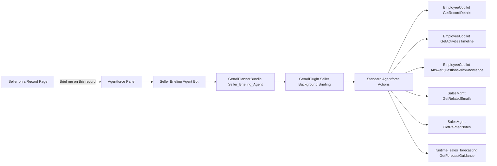

# Agentforce Quickstart: Seller Briefing Agent

A drop-in starter Agentforce employee agent that delivers a 30-second sales briefing from any Lead, Opportunity, or Account record page. Pulls the primary record plus tangential context — related contacts, opportunities, recent tasks, events, emails, and notes — and synthesizes a structured brief built entirely on standard, out-of-the-box Agentforce actions. Zero Apex, zero Flow, zero prompt templates required.

Designed as a reusable foundation that sales teams can clone and differentiate to their voice, playbook, and process.

---

## Install

Pick the install path that matches your comfort level. All three end at the same place: an active **Seller Briefing Agent** in your org with a permission set ready to assign.

### Option 1 — Agentforce Vibes (recommended, zero developer experience required)

If you have [Agentforce Vibes](https://www.salesforce.com/agentforce/vibes/) installed, this is the lowest-friction path. Vibes will install any missing prerequisites for you (Node.js, Salesforce CLI, Homebrew on macOS), deploy the agent, and activate it.

1. Open Vibes and start a new chat.
2. In the Vibes chat panel, set **Auto-approve** to allow **Read (all), Edit (all), All Commands, MCP**. This lets Vibes install missing tools without stopping at every prompt.
3. Open [`VIBES_PROMPT.md`](VIBES_PROMPT.md) in this repo and copy the contents of the fenced block.
4. Paste it into Vibes. Vibes will:
   - Detect and auto-install any missing prerequisites (Homebrew, Node.js, Salesforce CLI, Git).
   - Pause once for you to log into your Salesforce org in a browser tab (the only step that genuinely needs you).
   - Clone this repo, deploy the metadata, create + activate the agent, and assign the permission set.
5. When Vibes prints "All set," skip to [Test it](#test-it) below.

> If Homebrew has never been installed on your Mac, the very first install may prompt you for your Mac login password in the terminal. Type it (you won't see characters as you type — that's normal) and Vibes will continue from there.

### Option 2 — One-line CLI (`setup.sh`)

If you have the Salesforce CLI and an authorized org:

```bash
git clone https://github.com/ajkraft/Agentforce-Quickstart-Seller-Briefing-Agent.git
cd Agentforce-Quickstart-Seller-Briefing-Agent
./setup.sh                        # uses your default org
# or
./setup.sh MyOrgAlias             # targets a specific org alias
```

The script deploys the metadata, activates the agent, and assigns the permission set to your running user. If direct deploy fails because a target org is missing one of the standard managed actions (rare), it falls back to `sf agent create --spec` to rebuild the agent from a YAML spec.

### Option 3 — Manual CLI

If you'd rather see each step:

```bash
sf project deploy start --target-org MyOrgAlias
sf agent activate --api-name Seller_Briefing_Agent --version 1 --target-org MyOrgAlias
sf org assign permset --name Seller_Briefing_Agent --target-org MyOrgAlias
```

---

## Prerequisites

- A Salesforce org with **Agentforce enabled** (Einstein 1 Platform / Agentforce SKU).
- **Sales Cloud features active** if you want the full experience — the agent calls standard actions from `EmployeeCopilot`, `SalesMgmt`, and `runtime_sales_forecasting`. Standard Sales Cloud orgs have these by default.
- For **Option 2/3**: Salesforce CLI installed (`brew install --cask sf-cli` on macOS, or [download](https://developer.salesforce.com/tools/salesforcecli)) and an authorized org (`sf org login web -a MyOrgAlias`).

---

## Test it

1. Open any **Lead**, **Opportunity**, or **Account** record in Lightning.
2. Click the **Agentforce panel** (the sparkle icon in the upper-right utility bar).
3. Ask: *"Brief me on this record."*
4. The agent will call `EmployeeCopilot__GetRecordDetails` for the primary record, pull related activities, emails, notes, and forecast guidance, and respond with a structured brief: snapshot, recent activity, key people, related context, and a suggested next step.

If the panel doesn't appear, confirm the **Seller Briefing Agent** permission set is assigned to your user (Setup → Permission Sets → Seller Briefing Agent → Manage Assignments) and that the agent is **Active** (Setup → Agents → Seller Briefing Agent).

---

## What's in this repo

```
Agentforce-Quickstart-Seller-Briefing-Agent/
├── README.md                      You're reading it
├── VIBES_PROMPT.md                Copy-paste this into Agentforce Vibes
├── LICENSE                        MIT
├── setup.sh                       One-line CLI install
├── sfdx-project.json
├── specs/
│   └── seller-briefing-agent.yaml Agent spec (used by the fallback path)
└── force-app/main/default/
    ├── bots/Seller_Briefing_Agent/
    │   ├── Seller_Briefing_Agent.bot-meta.xml
    │   └── v1.botVersion-meta.xml
    ├── genAiPlannerBundles/Seller_Briefing_Agent/
    │   └── Seller_Briefing_Agent.genAiPlannerBundle
    ├── genAiPlugins/
    │   └── Seller_Background_Briefing.genAiPlugin-meta.xml
    └── permissionsets/
        └── Seller_Briefing_Agent.permissionset-meta.xml
```

### How it runs at runtime



The agent is built on standard managed actions only — no custom Apex, no custom Flow, no custom prompt templates. That's deliberate: it makes this a clean foundation you can extend with your own actions without unwinding any quickstart-specific glue.

---

## Customize it

The agent's behavior is driven by two things you can edit and redeploy:

- **Topic instructions** — what the agent does and when. Edit `force-app/main/default/genAiPlugins/Seller_Background_Briefing.genAiPlugin-meta.xml`. The `<scope>` and `<genAiPluginInstructions>` blocks are the levers.
- **Agent role and tone** — voice and posture. Edit `force-app/main/default/bots/Seller_Briefing_Agent/v1.botVersion-meta.xml` (`<role>`, `<company>`, `<toneType>`).

After editing, redeploy and reactivate:

```bash
sf project deploy start
sf agent activate --api-name Seller_Briefing_Agent --version 1
```

To add your own actions (Apex, Flow, or another standard action), add a `<genAiFunctions><functionName>...</functionName></genAiFunctions>` entry to the GenAiPlugin file and redeploy.

---

## Why this isn't a packaged install

Salesforce's official packageable-component list does not include `Bot` or `BotVersion` in any 1GP unmanaged package, 2GP unlocked package, or 1GP managed package — so a traditional "install URL" is structurally impossible for an Agentforce agent today. The only paths Salesforce supports are direct metadata deploy (this repo) and AppExchange-distributed 2GP managed packages. For a quickstart, the SFDX-repo-plus-CLI pattern matches what Salesforce architects ship publicly (e.g. [Pat Dennis's Deal Review Agent](https://github.com/PatrickDennisSFDC/deal-review-agent)) and avoids the packaging walls entirely.

---

## Disclaimer

This is a community sample, not an official Salesforce product. It's intended for demos, accelerators, and as a starting point for your own customizations. Use at your own risk; review and test in a sandbox before deploying to production.

---

## License

MIT — see [`LICENSE`](LICENSE).
