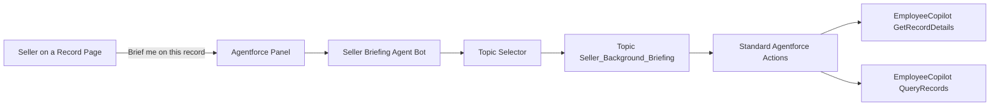

# Agentforce Quickstart: Seller Briefing Agent

A drop-in starter **internal Agentforce employee agent** that delivers a 30-second sales briefing from any Lead, Opportunity, or Account record page. Pulls the primary record plus tangential context — related contacts, opportunities, recent tasks, and recent events — and synthesizes a structured brief built entirely on standard, out-of-the-box Agentforce actions. Zero Apex, zero Flow, zero prompt templates required.

The agent is defined by a hand-authored Agent Script (`.agent` file) that explicitly declares `agent_type: "AgentforceEmployeeAgent"` so it lands in your org as an internal employee agent (the kind that runs in the Lightning utility bar) — not a service/messaging agent. Install creates the agent via `sf agent publish authoring-bundle`.

Designed as a reusable foundation that sales teams can clone and differentiate to their voice, playbook, and process.

---

## Install

Pick the install path that matches your comfort level. All three end at the same place: an active **Seller Briefing Agent** in your org with a permission set ready to assign.

### Option 1 — Agentforce Vibes (recommended, zero developer experience required)

If you have [Agentforce Vibes](https://www.salesforce.com/agentforce/vibes/) installed, this is the lowest-friction path. Vibes will install any missing prerequisites for you (Node.js, Salesforce CLI, Homebrew on macOS), publish the agent, and activate it.

1. Open Vibes and start a new chat.
2. In the Vibes chat panel, set **Auto-approve** to allow **Read (all), Edit (all), All Commands, MCP**. This lets Vibes install missing tools without stopping at every prompt.
3. Open [`VIBES_PROMPT.md`](VIBES_PROMPT.md) in this repo and copy the contents of the fenced block.
4. Paste it into Vibes. Vibes will:
   - Detect and auto-install any missing prerequisites (Homebrew, Node.js, Salesforce CLI, Git).
   - Pause once for you to log into your Salesforce org in a browser tab (the only step that genuinely needs you).
   - Clone this repo, validate the Agent Script, publish the authoring bundle, deploy the permission set, activate the agent, and assign the permission set to you.
5. When Vibes prints "All set," skip to [Test it](#test-it) below.

> If Homebrew has never been installed on your Mac, the very first install may prompt you for your Mac login password in the terminal. Type it (you won't see characters as you type — that's normal) and Vibes will continue from there.

### Option 2 — One-line CLI (`setup.sh`)

If you have the Salesforce CLI and an authorized org:

```bash
git clone https://github.com/ajkraft/Agentforce-Quickstart-Seller-Briefing-Agent.git
cd Agentforce-Quickstart-Seller-Briefing-Agent
./setup.sh                        # uses your default org
# or
./setup.sh MyOrgAlias             # targets a specific org alias
```

### Option 3 — Manual CLI

If you'd rather see each step:

```bash
sf agent validate authoring-bundle \
  --api-name Seller_Briefing_Agent \
  --target-org MyOrgAlias
sf agent publish authoring-bundle \
  --api-name Seller_Briefing_Agent \
  --skip-retrieve \
  --target-org MyOrgAlias
sf agent activate \
  --api-name Seller_Briefing_Agent \
  --version 1 \
  --target-org MyOrgAlias
./scripts/patch-page-context.sh MyOrgAlias        # REQUIRED — see below
sf project deploy start \
  --metadata "PermissionSet:Seller_Briefing_Agent" \
  --target-org MyOrgAlias
sf org assign permset \
  --name Seller_Briefing_Agent \
  --target-org MyOrgAlias
```

`sf agent publish authoring-bundle` compiles `force-app/main/default/aiAuthoringBundles/Seller_Briefing_Agent/Seller_Briefing_Agent.agent` and creates the underlying Bot, BotVersion, GenAiPlannerBundle, and GenAiPlugin in your org. Because the `.agent` file declares `agent_type: "AgentforceEmployeeAgent"`, the result is an internal employee agent. We deliberately don't use `sf agent create --spec` or `sf agent generate authoring-bundle --spec` — both have a known issue where they ignore the spec's `agentType: internal` and produce a Service Agent.

`scripts/patch-page-context.sh` is **required** after every publish. The Agent Script DSL emits the agent's `currentRecordId` and `currentObjectApiName` variables with `<visibility>Internal</visibility>` in the deployed BotVersion XML, which prevents the Lightning runtime from injecting the on-screen record ID. The patcher retrieves the deployed BotVersion, flips both variables to `External` with `includeInPrompt=true` (matching the shape of Salesforce's reference employee agents), and redeploys. Without it, the agent will not auto-detect the record you're viewing. See the script's header comment for details.

### Already installed a broken version?

Earlier revisions of this quickstart (commits before `c000000`) shipped pre-built Bot metadata or used `sf agent create --spec`, both of which produced a Service Agent rather than an internal employee agent. If you installed before this fix and saw "Configuration Issues Detected," "Agent User required," or `Type: Service Agent` in Setup, delete the old agent first:

1. **Setup → Agentforce Agents → Seller Briefing Agent → Delete.**
2. Re-run any install option above.

---

## Prerequisites

- A Salesforce org with **Agentforce enabled** (Agentforce 1 Platform / Agentforce SKU).
- **Sales Cloud features active** for the full experience — the agent calls `EmployeeCopilot__GetRecordDetails` and `EmployeeCopilot__QueryRecords`. Standard Sales Cloud orgs have these by default.
- For **Option 2/3**: Salesforce CLI installed (`brew install sf-cli` on macOS, or [download](https://developer.salesforce.com/tools/salesforcecli)) and an authorized org (`sf org login web -a MyOrgAlias`).

---

## Test it

Open any **Lead, Opportunity, or Account** record in Lightning, click the Agentforce panel (sparkle icon in the upper-right utility bar), and ask:

> *"Brief me on this account."*
>
> *"Tell me about this lead."*
>
> *"What do I need to know about this opportunity?"*

The agent reads the record on screen automatically — the page-context patcher run during install wires `currentRecordId` and `currentObjectApiName` to the Lightning runtime — and produces a structured 30-second briefing with snapshot, recent activity, key contacts, related context, and a suggested next step.

### Ask by name from anywhere

The agent also works from the Agentforce app home, the Agent Builder's Live Test Mode, or any other surface where there's no record context. Just include the record's name in your message:

> *"Brief me on the Acme Corp account."*
>
> *"Tell me about lead Jane Doe."*
>
> *"What do I need to know about the Smith renewal opportunity?"*

The agent will call `QueryRecords` to find the matching record and synthesize the briefing from its result.

### Adding more users

Every additional user who needs to use the agent must have the **Seller Briefing Agent** permission set assigned. The install assigns it to whoever ran the install; for additional users:

```bash
sf org assign permset --name Seller_Briefing_Agent --on-behalf-of <username> --target-org MyOrgAlias
```

…or via Setup → Permission Sets → Seller Briefing Agent → Manage Assignments → Add Assignments.

### If the agent panel doesn't appear

- Confirm the **Seller Briefing Agent** permission set is assigned to your user (Setup → Permission Sets → Seller Briefing Agent → Manage Assignments).
- Confirm the agent is **Active** (Setup → Agentforce Agents → Seller Briefing Agent).
- Refresh the record page after assigning the permission set.

### If the agent says "I don't have the record context for this page yet"

The page-context patcher didn't run, or it ran against a different BotVersion than the active one. Re-run it:

```bash
./scripts/patch-page-context.sh MyOrgAlias
```

Then refresh the record page.

---

## What's in this repo

```
Agentforce-Quickstart-Seller-Briefing-Agent/
├── README.md                                         You're reading it
├── VIBES_PROMPT.md                                   Copy-paste this into Agentforce Vibes
├── LICENSE                                           MIT
├── setup.sh                                          One-line CLI install
├── scripts/
│   └── patch-page-context.sh                         Post-publish: wires page-context binding
├── sfdx-project.json
└── force-app/main/default/
    ├── aiAuthoringBundles/Seller_Briefing_Agent/
    │   ├── Seller_Briefing_Agent.agent               THE source of truth (Agent Script)
    │   └── Seller_Briefing_Agent.bundle-meta.xml
    └── permissionsets/
        └── Seller_Briefing_Agent.permissionset-meta.xml
```

The Bot, BotVersion, GenAiPlannerBundle, and GenAiPlugin metadata are **not** in this repo — they're generated fresh in your target org by `sf agent publish authoring-bundle` from the Agent Script. After publishing you can optionally retrieve them with `sf project retrieve start --metadata Bot:Seller_Briefing_Agent` if you want the underlying Bot XML locally.

### How it runs at runtime



The agent is built on standard managed actions only — no custom Apex, no custom Flow, no custom prompt templates. That's deliberate: it makes this a clean foundation you can extend with your own actions without unwinding any quickstart-specific glue.

---

## Customize it

The Agent Script (`force-app/main/default/aiAuthoringBundles/Seller_Briefing_Agent/Seller_Briefing_Agent.agent`) is the source of truth. Common customizations:

- **Briefing format / step-by-step reasoning** — edit the `instructions:` block under `topic Seller_Background_Briefing`.
- **Welcome / error messages** — edit the `system: messages:` block at the top.
- **Role, company, description** — edit the `config:` block. (`config: agent_type:` MUST stay `"AgentforceEmployeeAgent"` — that's what makes it an internal agent.)
- **Add an action** — add it to the `actions:` block of the topic and add a corresponding entry under the bottom-level `actions:` definition section.

After editing, re-publish with:

```bash
sf agent validate authoring-bundle --api-name Seller_Briefing_Agent
sf agent publish authoring-bundle --api-name Seller_Briefing_Agent --skip-retrieve
sf agent activate --api-name Seller_Briefing_Agent --version <latest>
./scripts/patch-page-context.sh                  # rewires the new BotVersion's page-context binding
```

`sf agent publish` creates a new BotVersion each time, and that new BotVersion's `currentRecordId` / `currentObjectApiName` variables ship with `<visibility>Internal</visibility>` (the Agent Script DSL doesn't currently expose External). Without re-running the patcher, the agent will stop reading the record on screen on the new active version. Always run the patcher after publish.

---

## Disclaimer

This is a community sample, not an official Salesforce product. It's intended for demos, accelerators, and as a starting point for your own customizations. Use at your own risk; review and test in a sandbox before deploying to production.

---

## License

MIT — see [`LICENSE`](LICENSE).
